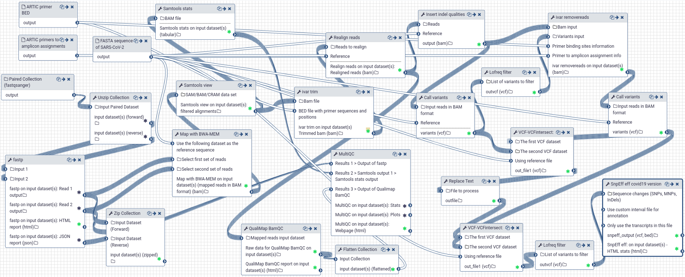

## Live Resources

| usegalaxy.eu | usegalaxy.org.au |
|:--------:|:------------:|
| <FlatShield label="data" message="view" href="https://usegalaxy.eu/library/list#folders/F2a32545de855d335" alt="Raw data" /> | |
| <FlatShield label="workflow" message="run" href="https://usegalaxy.eu/u/bgruening/w/sars-cov2-amplicon-artic" alt="Galaxy workflow" /> | <FlatShield label="workflow" message="run" href="https://usegalaxy.org.au/u/pvanheus/w/imported-covid-19-amplicon-artic" alt="Galaxy workflow" />  |

## Amplicon Analysis using Artic workflows

The [ARTIC Network](https://artic.network) is a collaborative project between a number of laboratories around the world that wants to provide
protocols and advice on viral outbreaks. Their website states that part of their goal is to devlop *"an end-to-end system for processing samples
from viral outbreaks to generate real-time epidemiological information that is interpretable and actionable by public health bodies."* 

The ARTIC network has made available laboratory protocols, primer sets and bioinformatics workflows. The protocol they use relies upon direct
amplification of the virus using tiled, multiplexed primers. According to their website, *this approach has been proven to have high sensitivity
and work directly from clinical samples (compared to metagenomics approaches).*

The amplicon approach using the protocol outlined by the ARTIC network has been widely adopted by groups worldwide and a fair percentage of
the COVID genome sequences uploaded to GISAID and raw reads uploaded to the SRA have been produced by this method.

Along with the laboratory protocols for sequencing (both for Illumina and Nanopore sequencing technologies), several tools and workflows
have been developed to handle what is essentially non-random sequencing data.

## The workflow

|  |
|:------------------:|
| Galaxy workflow for ARTIC analysis of amplicon data from Illumina sequencing |

The workflow makes use of the [iVar software](https://andersen-lab.github.io/ivar/html/) from the Andersen Lab at the
Scripps Research Institute in California for trimming the primer section of reads and also, currently, for variant calling.
The ARTIC primer BED files for use with this workflow can be found at the
[ARTIC nCov2019 Github](https://github.com/artic-network/artic-ncov2019/tree/master/primer_schemes/nCoV-2019). The correct primer BED file for the version of the primers used during sequencing should be used.

Note that the V3 BED file has a [known](https://github.com/artic-network/artic-ncov2019/issues/12) formatting
problem which can be solved with a command line command (`awk 'BEGIN {OFS="\t"; FS="\t"} $5=60' ARTICv3.bed  >ARTICv3_fixed.bed`)
or the equivalent awk program (`BEGIN {OFS="\t"; FS="\t"} $5=60}`) run in the Galaxy awk tool.

The trimming of primer positions leads to some variants only appearing on a single strand, which causes problems for some
variant calling software. We are examing how to best adapt a variant calling workflow (besides iVar) for this situation.

     &nbsp;&nbsp;
     &nbsp;&nbsp;
     &nbsp;&nbsp;
     &nbsp;

## Reference

Nathan D Grubaugh, Karthik Gangavarapu, Joshua Quick, Nathaniel L Matteson, Jaqueline Goes De Jesus, Bradley J Main, Amanda L Tan, Lauren M Paul, Doug E Brackney,
Saran Grewal, Nikos Gurfield, Koen KA Van Rompay, Sharon Isern, Scott F Michael, Lark L Coffey, Nicholas J Loman, Kristian G Andersen,
[An amplicon-based sequencing framework for accurately measuring intrahost virus diversity using PrimalSeq and iVar](https://doi.org/10.1101/383513), Genome Biology 2019 20:8

