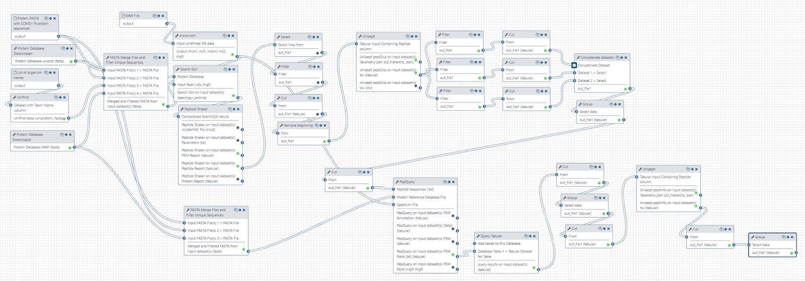

# Metaproteomics analysis of Gargling samples from CoviD-19 infected patients

## Live Resources

| usegalaxy.eu |
|:--------:|:------------:|:------------:|:------------:|:------------:|
| <FlatShield label="data library" message="view" href="https://usegalaxy.eu/library/list#folders/F61b36ed9cec77ec5" alt="Raw data from data library" /> |
| <FlatShield label="Input data for RAW 02" message="view" href="https://usegalaxy.eu/u/pratikjagtap/h/input-for-pxd01868202" alt="Raw data plus auxillary data" /> |
| <FlatShield label="Input data for RAW 03" message="view" href="https://usegalaxy.eu/u/pratikjagtap/h/input-for-pxd01868203" alt="Raw data plus auxillary data" /> |
| <FlatShield label="Result history RAW 02" message="view" href="https://usegalaxy.eu/u/pratikjagtap/h/output-for-pxd01868202-july-4-2020" alt="Galaxy history" /> |
| <FlatShield label="Result history RAW 03" message="view" href="https://usegalaxy.eu/u/pratikjagtap/h/output-for-pxd01868203-july-4th-2020" alt="Galaxy history" /> |
| <FlatShield label="workflow" message="run" href="https://usegalaxy.eu/u/pratikjagtap/w/workflow-constructed-from-history-workflow" alt="Galaxy workflow" /> |

## Description

Ihling et al have published a protein MS-based ‘proof-of-principle’ method to detect SARS-CoV-2 virus proteins from gargle samples from COVID-19 patients
(see [here](../PXD018682/)).
In the original manuscript, the authors detected peptides from SARS-CoV-2 virus proteins and present evidence for their spectral annotation. 

We were interested in exploring the possibility of presence of microorganisms in the samples from the original manuscript.
For this, Peter Thuy-Boun (Wolan Lab, Scripps Institute) searched the two RAW files using [COMPIL 2.0](https://pubs.acs.org/doi/10.1021/acs.jproteome.8b00722)
against a comprehensive 113 million protein sequences and roughly 4.8 billion unique tryptic peptide sequences database library.
The peptides identified through this approach were subjected to [Unipept](doi:10.1021/acs.jproteome.8b00716) 4.3 analysis to detect
the most abundant genera and species present in the sample. Five most significant genera/species were used along with the RAW files and
COVID-19 protein database as inputs for a Galaxy workflow to a) search the datasets; b) detect microbial peptides and determine the taxonomy associated
with the peptides using Unipept; c) validation of peptide spectral matches by using [PepQuery](https://genome.cshlp.org/content/29/3/485.full) and
determining the number of valid peptides corresponding to microbial taxonomic units.

The analysis of the gargling solutions using COMPIL 2.0 and Unipept (both outside of Galaxy) and using SearchGUI/PeptideShaker, Unipept and PepQuery (all within Galaxy workflows)
resulted in detection of three opportunistic pathogens - *Elizabethkingia*, *Stenotrophomonas maltophilia* and *Streptococcus pneumoniae*. 

## Workflow

The Galaxy workflow includes RAW data conversion to MGF and mzML format. The MGF files are searched against the combined database of Human Uniprot proteome, contaminant proteins and SARS-Cov-2 proteins database using X!tandem, MSGF+, OMSSA search algorithms with SearchGUI and FDR and protein grouping using PeptideShaker. The unique peptides were searched with Unipept to obtain the taxa and functional annotation and to confirm the presence of metaproteomes. The detected peptides were later subjected to analysis by PepQuery and Lorikeet to ascertain the quality of peptide identification.

## Results

|Taxonomic Unit  |  Number of validated peptides  |Number of validated peptides|
|:--------------:|:--------:|:------------:|
|                | PXD018682_02.raw | PXD018682_03.raw |
|*Elizabethkingia* |   18        |          36|
|*Stenotrophomonas maltophilia* |   5        |      11    |
|*Streptococcus pneumoniae*     |   3        |  1         |

*Elizabethkingia* was found as the most abundant genus in both the COVID-19 patients samples. *Elizabethkingia* is an emerging pathogen determined
to be cause of life-threatening infections in humans, particularly in [immunocompromised patients](https://pubmed.ncbi.nlm.nih.gov/31466280/).
Its mortality rate has been especially high as a result of a high rate of [drug resistance](https://www.ncbi.nlm.nih.gov/pmc/articles/PMC4041001/).
*Stenotrophomonas maltophilia* is another emerging multi-drug resistant opportunistic pathogen originating in hospital settings, especially
among [immunocompromised hosts](https://www.ncbi.nlm.nih.gov/pmc/articles/PMC4557615/). S. maltophilia has shown to cause latent pulmonary
infection in [immunocompromised patients](https://pubmed.ncbi.nlm.nih.gov/16735148/) and its colonization rates in cystic fibrosis patients
have been [increasing](https://www.ncbi.nlm.nih.gov/pmc/articles/PMC1865680/).
Lastly, *Streptococcus pneumoniae* is a commensal microorganism that colonizes the upper respiratory tract in healthy individuals.
However, in susceptible individuals with weaker immune systems, such as the elderly, the bacterium may become pathogenic and spread to other locations to cause disease.

Clinical studies have started identifying possible co-infecting bacteria in [COVID-19 patients](https://pubmed.ncbi.nlm.nih.gov/32408156/).
Amongst these *S. pneumoniae* has been shown to be the [most common](https://www.ncbi.nlm.nih.gov/pmc/articles/PMC7245213/),
although we have not come across any studies that indicated that *Elizabethkingia* and *S. maltophila* detected as co-infecting pathogens.
Our analysis raises the possibility that *Elizabethkingia*, *S. maltophila* could be present as a co-infection in the COVID-19 patients.
Both of these bacteria are known to be nosocomial, opportunistic pathogens in immuno-compromised patients and are difficult to treat because of its multi-drug resistance.

Interestingly, the PepQuery analysis indicates that the spectral evidence for the detection of the peptides from these organisms is quite solid.
We plan to perform Lorikeet analysis to ascertain the spectral evidence. We have also contacted the authors of the original manuscript and
reported our findings and have discussed the possibility of using new gargling solutions samples to detect the presence of any cohabitating
emerging pathogens in COVID-19 patients using mass spectrometry based metaproteomics analysis.

